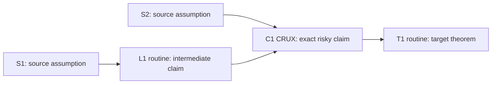
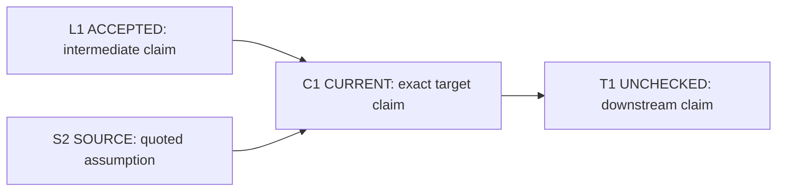

# Experimental proof-map overlay

**Status:** optional and untested. This is a companion to `PROTOCOL.md`, not part of the protocol.
If the two conflict, `PROTOCOL.md` controls. The experiment is inspired by the dependency graph and
interface checks in [VALG Workflow 2](https://github.com/DechenZhang/VALG-ML-Theory-Agent) and its
[paper](https://arxiv.org/abs/2608.13060).

## What this tests

A linear step list says what comes next, but it makes dependency changes expensive to trace. This
overlay tests whether a small proof graph makes three checks cheaper for the human verifier:

1. locating the current claim in the larger proof;
2. comparing its exact output with the form required downstream;
3. seeing which accepted claims become unchecked after an upstream change.

The map is an index into the proof, not evidence for it. An arrow records a declared dependency. It
does not certify that the implication is valid.

## How to run the experiment

Paste this file after `PROTOCOL.md`. Use the overlay only when the chosen route has at least three
dependent proof steps. For a short or essentially linear argument, the ordinary Phase 1 list is
cheaper. The remaining sections are instructions for the model and the trial record.

## Overlay rules

This overlay changes presentation only. Every phase gate, length budget, mandatory artifact,
banned move, and stopping rule in the protocol remains in force.

### Node and edge rules

- Give every claim a stable ID and a one-line, human-readable statement. Keep the same ID and
  wording across turns unless the mathematical claim changes.
- Draw edges from premises to the claims that consume them.
- A map is an index, not a proof. Never use an edge, layout, or status word as evidence.
- Never use confidence scores. A node state may record only an observable event:
  `SOURCE` means its statement appears verbatim in the Quote block; `ACCEPTED` means the user
  explicitly accepted the step; `CURRENT` is the one Phase 2 step being worked; `BLOCKED` means an
  explicit gap, rejection, or `NOT MET` ledger row stops it; `UNCHECKED` means it has not been
  accepted or an upstream change invalidated it.
- Do not encode information by color alone. Put every state in the node text.

### Phase 1: replace the linear skeleton with a proof map

After any route choice, present the chosen route as one Mermaid `flowchart LR`. Each node contains
its stable ID, one-line claim, and either `routine` or `CRUX`. Show proposed dependencies as arrows.
This map replaces the ordered step list; it is not an additional artifact. Keep the whole Phase 1
response within one page and work out no proof content. Keep the top-level map to at most eight
nodes. If the route is longer, group consecutive routine steps into a plainly named subproof node;
expand that node only when it becomes current in Phase 2.

Template:



### Phase 2: show only the local proof slice

At the start of each turn, show the current node, its immediate premise nodes, and its immediate
consumer nodes. Do not replay the full map unless the user asks or a board reset is needed. Keep at
most eight visible nodes. If necessary, collapse only a chain whose steps the user has accepted,
and name the collapsed block in plain language. If the current node is a grouped subproof, replace
it with that subproof's local nodes for this turn.

Template:



Immediately below the local slice, expose the current boundary:

| boundary | exact form |
|---|---|
| consumes | premise IDs and the exact forms used here |
| must produce | the full target claim, including quantifiers, object, norm or metric, probability mode, constants, and parameter dependence |
| consumer requires | consumer ID and the exact input form it needs |

Then provide the protocol's Type table and Precondition ledger. Do not duplicate their contents in
prose. The adjacent `must produce` and `consumer requires` rows are for the human to compare; do not
replace them with a model-generated `MATCH` verdict.

### State changes and invalidation

- Change a node to `ACCEPTED` only after the user explicitly accepts that step.
- If a claim changes in assumptions, quantifiers, object, norm or metric, probability mode,
  constants, or parameter dependence, keep its stable ID but mark it `CURRENT` or `UNCHECKED` and
  state the exact change.
- Maintain the canonical full map beside the open items in the same standing-log file. Messages
  show only the local slice.
- Mark every descendant of a changed or blocked node `UNCHECKED`. List only the first affected
  descendants in the message; update every affected node in the canonical map.
- Never preserve `ACCEPTED` merely because the revised claim sounds stronger or similar.
- Invalidation does not authorize a repair. Name the failed derivation, producer-consumer boundary,
  or formulation, propose the smallest repair target, and stop for the user's decision under the
  existing protocol.

### Phase 3

If Phase 3 is requested, use the accepted full map as the assembly order. The map remains a table of
contents for the proof, not a substitute for any argument.

## What to record after a trial

Keep one short note per proof session:

```text
Proof/session:
Returned after a break? yes/no
Time to locate the current crux and its dependencies:
Interface mismatch exposed? what was different:
Invalidated descendant exposed? which one:
Map upkeep that did not help verification:
Concrete error caught or made cheaper to find:
```

Do not promote this overlay into `PROTOCOL.md` because it looks clearer. Test it on at least three
real sessions. A protocol change has earned consideration only if the map catches a concrete error,
prevents work from continuing on an invalidated step, or repeatedly reduces reorientation time
without causing phase-budget violations.
